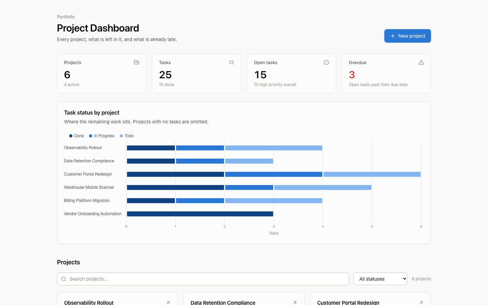
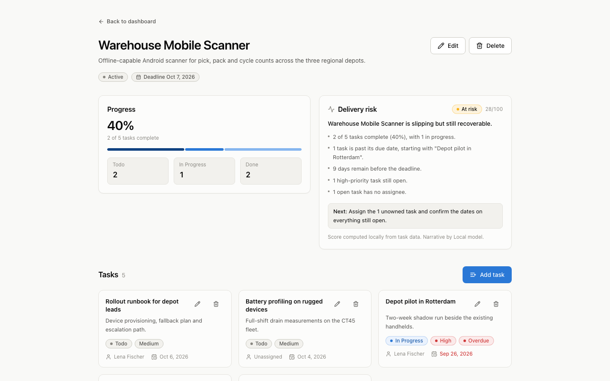
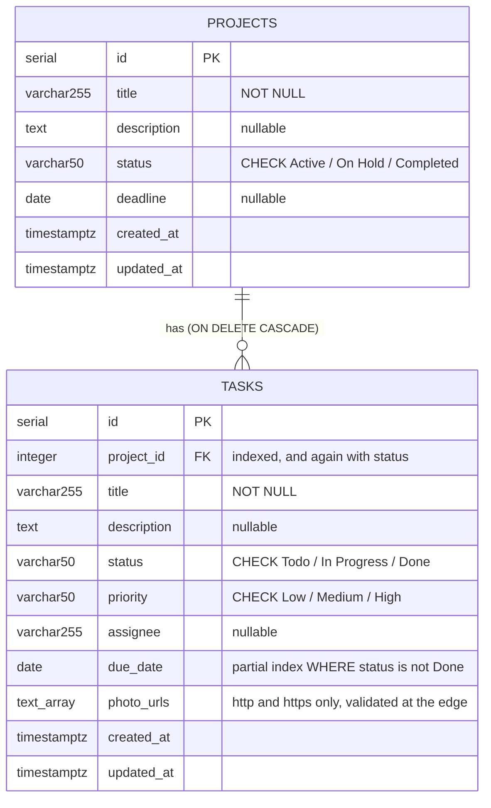
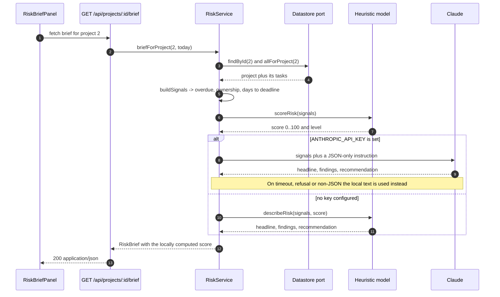

# Project Dashboard

A project and task tracker that answers one question on the way in — *which of these
is going to be late?* — and then lets you drill into why.



Built with Next.js 15 (App Router), TypeScript, Tailwind v4, TanStack Query and
Chart.js, over PostgreSQL. It ships with an in-memory driver seeded with demo data,
so the screenshot above is what you get from `npm install && npm run dev` on a clean
checkout with no database running.

---

## Run it

```bash
npm install
npm run dev          # http://localhost:3000
```

That is the whole setup. With no `DATABASE_URL` and no `DATA_DRIVER` in the
environment, the app resolves to the in-memory driver and seeds 6 projects and 25
tasks with deadlines relative to today — a mix of overdue, due-this-week and
comfortable — so every screen has something in it. Nothing is persisted: restart
the process and the seed is regenerated.

### Against a real PostgreSQL

```bash
createdb project_dashboard
export DATABASE_URL=postgres://localhost:5432/project_dashboard
npm run db:schema    # tables, constraints and indexes
npm run db:seed      # optional demo rows
npm run dev
```

Setting `DATABASE_URL` is enough — the driver switches on its own. `db/schema.sql`
is idempotent (`CREATE TABLE IF NOT EXISTS`), so re-running it against an existing
database is safe.

---

## What you are looking at

**The dashboard** carries four counted totals, one chart and the project grid. The
totals come from a single aggregate query rather than from tallying downloaded
rows, and the chart is task status per project — the one view that says where the
remaining work actually sits.

**A project page** pairs the task breakdown with a delivery-risk brief, then lists
the tasks with their owner, due date and an overdue flag.



Search and the status filter drive the server query (`?search=`, `?status=`), so
filtering a large portfolio does not mean downloading it first. A full-page capture
of the dashboard, project grid included, is at
[`docs/screenshots/dashboard-full.png`](docs/screenshots/dashboard-full.png), and the
create form at
[`docs/screenshots/create-project.png`](docs/screenshots/create-project.png).

---

## Two tables



Five indexes exist because five queries need them (`db/schema.sql`):

| Index | Serves |
|---|---|
| `tasks_project_id_idx` | the task list on a project page |
| `tasks_project_status_idx` | `GROUP BY project_id, status` behind the dashboard chart |
| `tasks_open_due_date_idx` (partial, `status <> 'Done'`) | the overdue count |
| `projects_created_at_idx` | the default list ordering |
| `projects_status_idx` | the status filter on the dashboard |

The `CHECK` constraints mirror the status and priority registries in
`lib/domain/`. Those registries are the single source of truth: adding a status
there flows through Zod validation, the filter dropdown, the analytics buckets and
the pill colour without touching anything else.

---

## How a delivery-risk brief is produced

Each project page asks `GET /api/projects/:id/brief` for a verdict. The score is
arithmetic; only the prose is ever written by a language model.



`buildSignals` (`lib/ai/types.ts`) reduces a project and its tasks to a small
record of measured facts — overdue count, open high-priority count, unassigned
open count, days to deadline, completion ratio, and the three open tasks that most
need attention, ranked worst first. `scoreRisk` (`lib/ai/heuristic.ts`) turns that
into 0–100 with named weights and per-signal caps, so no single runaway count can
saturate the score on its own, and a completed project scores zero whatever else
is true of it.

Both providers implement one interface:

```ts
export interface RiskBriefProvider {
  readonly name: string;
  brief(signals: RiskSignals): Promise<RiskBrief>;
}
```

`HeuristicRiskBriefProvider` is the default and needs no key, no network and no
configuration. `AnthropicRiskBriefProvider` calls the Messages API through the
official SDK for the narrative only, and falls back to the local text on every
failure path — missing key, timeout, refusal, unparseable reply. The UI names the
source in the panel footer, so a reader never has to guess which one they are
looking at. There is no configuration in which this endpoint fails.

---

## The path a request takes

```
app/api/**/route.ts     parse the request, call one service, return
lib/services/           business rules, cross-entity checks, caching
lib/data/types.ts       three repository interfaces - the port
lib/data/postgres/      SQL, parameterised, mapping rows into the domain
lib/data/memory/        the same three interfaces, backed by arrays
lib/domain/             types, status registries, errors, date handling
lib/schemas/            Zod DTOs shared by client and server
```

Route handlers are one to four statements each. They do not know what a connection
pool is; `lib/services/index.ts` is the one place that wires a datastore and an AI
provider into the services, and `lib/data/index.ts` is the one place that decides
which driver to build.

Three consequences worth naming:

- **No `try`/`catch` in a handler.** `lib/http/respond.ts` holds the only mapping
  from a thrown value to a status code: a `ZodError` becomes a 400 carrying the
  failing field paths, an `AppError` carries its own status, and everything else is
  a 500 whose internals are logged rather than returned.
- **No identifier interpolation in SQL.** `UPDATE` builds its `SET` clause from a
  fixed domain-field-to-column map, so the only caller-controlled values in a query
  are bound parameters.
- **One query per page of cards, not one per card.** `ProjectService.listWithProgress`
  fetches a page of projects, then calls `countsByProject` once with every id on the
  page; the Postgres driver answers that with a single `GROUP BY project_id, status`.

Lists are paginated with a hard ceiling: `limit` defaults to 20 and a request above
`MAX_PAGE_SIZE` (100) is a 400, not a silently honoured full-table read.

---

## HTTP API

All bodies are JSON and camelCase. Errors are
`{"error": {"code": "...", "message": "...", "details": [...]}}`.

| Method | Path | Notes |
|---|---|---|
| `GET` | `/api/projects` | `?limit=&offset=&status=&search=`; items carry `taskCounts`, `totalTasks`, `progress` |
| `POST` | `/api/projects` | 201 with the created project |
| `GET` | `/api/projects/:id` | 404 `not_found` if absent |
| `PATCH` | `/api/projects/:id` | partial; an empty body is a 400 |
| `DELETE` | `/api/projects/:id` | 204; tasks cascade |
| `GET` | `/api/projects/:id/brief` | the delivery-risk brief |
| `GET` | `/api/tasks` | `?projectId=&status=&priority=&limit=&offset=` |
| `POST` | `/api/tasks` | 404 if the parent project does not exist |
| `PATCH` | `/api/tasks/:id` | partial; `projectId` is not accepted |
| `DELETE` | `/api/tasks/:id` | 204 |
| `GET` | `/api/analytics` | portfolio totals, counted by the datastore |
| `GET` | `/api/health` | 200 or 503; reports the active driver and AI provider |

```bash
curl -s localhost:3000/api/health
# {"status":"ok","driver":"memory","datastoreReachable":true,"aiProvider":"local-heuristic",...}
```

`photoUrls` is restricted to `http` and `https` at the schema level — a
`javascript:` or `data:` URL reaching an `` is how stored XSS starts, and
the validation lives in `lib/schemas/task.ts` rather than in the component.

---

## Configuration

Everything the server reads is declared once, in `lib/config.ts`, validated with
Zod at startup. See `.env.example`.

| Variable | Default | Effect |
|---|---|---|
| `DATABASE_URL` | unset | Postgres connection string. Setting it selects the Postgres driver. |
| `DATA_DRIVER` | inferred | `postgres` or `memory`. Overrides the inference. |
| `PGPOOL_MAX` | `10` | Pool size ceiling. |
| `PGPOOL_IDLE_TIMEOUT_MS` | `30000` | Idle client timeout. |
| `PGPOOL_CONNECTION_TIMEOUT_MS` | `5000` | Connection acquisition timeout. |
| `ANTHROPIC_API_KEY` | unset | Unset means the local risk model writes the brief. |
| `AI_MODEL` | `claude-opus-5` | Model id used when a key is present. |
| `AI_TIMEOUT_MS` | `8000` | Request timeout before falling back locally. |
| `ANALYTICS_CACHE_TTL_MS` | `10000` | In-process TTL for `/api/analytics`. `0` disables it. |

An invalid value is a startup error naming the variable, not a runtime surprise.

---

## Tests

```bash
npm test            # vitest run
npm run check       # lint + typecheck + test
```

154 tests across 11 files, all passing. Node tests by default; component tests opt
into jsdom with a `@vitest-environment jsdom` docblock. Nothing touches a database
— the in-memory driver implements the same repository interfaces the Postgres
driver does, which is what makes the service and route tests possible at all.

What is actually covered:

- **Route handlers** are imported and called directly with a `NextRequest`, so
  status codes, error shapes and validation failures are asserted end to end
  (`tests/api/routes.test.ts`).
- **The risk model** — monotonicity in the overdue count, the per-signal caps, a
  completed project scoring zero, determinism, and that no finding cites a number
  the signals do not contain.
- **The hosted provider's fallbacks** — network failure, a refusal, a non-JSON
  reply and a partial reply each fall back to the local text while keeping the
  locally computed score.
- **Regressions with a name.** `formatDate(null)` is `'—'` and never
  `'Invalid Date'`; `2026-02-31` is rejected rather than rolled into March; a
  `<Button>` defaults to `type="button"` so a Cancel inside a modal form closes it
  instead of submitting it.

---

## Docker

```bash
docker compose up --build     # app on :3000, postgres on :5432
```

The Dockerfile is three stages — dependency install against the lockfile, build,
then a runtime stage that copies only Next's standalone output and runs as a
non-root `nextjs` user. It carries a `HEALTHCHECK` against `/api/health`. Compose
brings up `postgres:16-alpine` with `db/schema.sql` and `db/seed.sql` mounted into
`/docker-entrypoint-initdb.d`, and gates the app on the database's own healthcheck.

`docker compose config` parses. **The image build and container boot have not been
run** — Docker was unavailable on the machine this was last worked on, so treat
those two steps as unverified.

---

## What is not here

- **No authentication.** Every request can read and write every project. Adding it
  means a middleware plus an owner column; nothing in the current data model
  assumes a single tenant.
- **No optimistic updates.** Mutations invalidate and refetch. That is correct and
  slightly slower than it could be.
- **`photo_urls` holds links, not uploads.** There is no file storage.
- **The in-memory driver is not durable and not concurrent.** It exists for the
  demo and for the tests, and holds everything in process memory.
- **Pagination is offset-based.** Fine at this size; a keyset cursor would be the
  right move past a few thousand projects.
- **No end-to-end browser tests.** Component and route coverage only.
